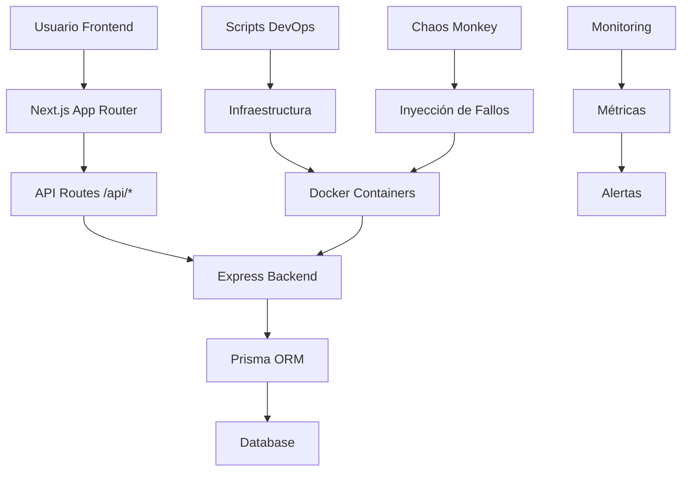

# 🏗️ SOCIAL_IS - Arquitectura del Sistema

## 📋 Introducción

**SOCIAL_IS** es una red social premium construida como laboratorio de ingeniería para prácticas DevOps. Combina una experiencia de usuario de clase mundial con una infraestructura robusta diseñada para simulaciones de estrés, pruebas de caos y escenarios de fallos realistas.

El proyecto sirve como **base para construir escenarios de estrés realistas para el equipo de DevOps**, permitiendo practicar:
- Fallos en pipelines CI/CD
- Tests rotos y builds fallidos
- Conflictos de merge y despliegues
- Simulaciones de caída de servicios

---

## 🛠️ Tecnologías Core

| Tecnología | Versión | Propósito | Características Clave |
|------------|---------|-----------|----------------------|
| **Bun** | v1.3+ | Runtime & Package Manager | Performance extrema, monorepos nativos |
| **Next.js** | 16.1.6 | Frontend Framework | App Router, Server Components, ISR |
| **React** | 19.2.3 | UI Library | Concurrent Features, Server Components |
| **Express** | - | Backend API | RESTful, middleware, routing |
| **Prisma** | - | ORM | Type-safe database access |
| **TypeScript** | v5 | Type System | Type safety, IntelliSense |
| **TailwindCSS** | v4 | Styling | Utility-first, responsive design |
| **Docker** | - | Containerization | Microservices, deployment |

---

## 📁 Desglose de Carpetas

### 🚀 `backend/` - Screaming Architecture

La arquitectura del backend sigue el principio **"Screaming Architecture"** donde la estructura del código cuenta la historia del sistema.

```
backend/
├── src/
│   ├── modules/
│   │   ├── posts/
│   │   │   ├── data/          # Datos y seeds
│   │   │   ├── routes/        # Endpoints REST
│   │   │   └── services/      # Lógica de negocio
│   │   └── users/             # Módulo de usuarios
│   ├── config/                # Configuración global
│   └── index.ts               # Entry point
├── prisma/
│   ├── schema.prisma          # Modelo de datos
│   └── seed.ts               # Datos iniciales
└── package.json              # Dependencias del backend
```

**Principios de Screaming Architecture aplicados:**
- ✅ **Nombres auto-explicativos**: `posts/`, `users/`, `routes/`
- ✅ **Separación de responsabilidades**: Cada módulo es independiente
- ✅ **Flujo evidente**: `data → routes → services`
- ✅ **Sin ambigüedad**: La estructura explica el propósito del sistema

### 🎨 `frontend/` - UI Premium con App Router

Estructura moderna de Next.js 14 con App Router para rendimiento óptimo y UX premium.

```
frontend/
├── src/
│   ├── app/                   # App Router (Next.js 14)
│   │   ├── layout.tsx        # Layout raíz
│   │   ├── page.tsx          # Homepage
│   │   └── globals.css       # Estilos globales
│   ├── components/           # Componentes reutilizables
│   │   ├── layout/           # Navbar, Footer
│   │   └── ui/               # Componentes base
│   └── features/             # Características de negocio
│       ├── feed/             # Feed de publicaciones
│       ├── stories/          # Historias
│       └── navigation/       # Navegación
├── package.json              # Dependencias del frontend
└── tailwind.config.ts        # Configuración de Tailwind
```

**Características del Frontend:**
- 🎯 **App Router**: Rendering híbrido cliente/servidor
- 🎨 **UI Premium**: Diseño moderno con TailwindCSS
- 📱 **Responsive**: Mobile-first approach
- ⚡ **Performance**: Optimizado con Bun runtime

### 🔬 `infra/` - Laboratorio de Pruebas de Estrés

Infraestructura dedicada a simulaciones de caos y escenarios de fallos DevOps.

```
infra/
├── stress-lab/
│   ├── docker-compose.yml    # Orquestación de servicios
│   ├── chaos-monkey/         # Scripts de caos
│   ├── load-tests/           # Pruebas de carga
│   └── monitoring/          # Métricas y alertas
├── k8s/                      # Manifiestos Kubernetes
└── terraform/               # Infraestructura como código
```

**Propósito del Laboratorio:**
- 🧪 **Simulaciones de estrés**: Testing de límites del sistema
- 💥 **Chaos Engineering**: Inyección controlada de fallos
- 📊 **Monitoring**: Métricas en tiempo real
- 🔄 **CI/CD Testing**: Validación de pipelines

### ⚡ `scripts/` - Command Center para Caos y Simulaciones

Scripts automatizados para ejecutar escenarios complejos de DevOps.

```
scripts/
├── dev-setup.sh             # Configuración del entorno
├── stress-test.sh           # Ejecución de pruebas de estrés
├── chaos-injector.sh        # Inyección de fallos
├── backup-restore.sh        # Backup y recuperación
└── health-check.sh          # Verificación de servicios
```

---

## 🔄 Flujo de Datos



### Comunicación Frontend ↔ Backend

1. **Frontend** realiza llamadas a `/api/posts` vía `fetch()`
2. **Express** en `localhost:5000` maneja las peticiones REST
3. **Prisma** ejecuta queries type-safe a la base de datos
4. **Respuesta** viaja por el mismo camino en formato JSON

### Interacción con Scripts de Infraestructura

1. **Scripts** ejecutan comandos Docker y Kubernetes
2. **Chaos Monkey** inyecta fallos en contenedores
3. **Monitoring** recolecta métricas de todos los servicios
4. **Alertas** se disparan basadas en umbrales configurados

---

## 🎯 Guía de Scripts Globales

### Comandos Principales del Monorepo

| Comando | Descripción | Área Impactada |
|---------|-------------|----------------|
| `bun run dev:all` | Inicia frontend + backend + infra | Desarrollo completo |
| `bun run dev` | Solo servidor de desarrollo Next.js | Frontend |
| `bun run build` | Build de producción del frontend | Frontend |
| `bun test` | Ejecuta todos los tests del proyecto | Testing |
| `bun install` | Instala dependencias del monorepo | Todas |

### Scripts de Desarrollo

```bash
# Levantar todo el ecosistema
bun run dev:all

# Desarrollo individual
cd frontend && bun run dev    # Frontend en :3000
cd backend && bun run dev     # Backend en :5000

# Testing
bun test                      # Tests unitarios + integración
bun run test:e2e             # Tests end-to-end
```

### Scripts de Infraestructura

```bash
# Pruebas de estrés
./scripts/stress-test.sh

# Inyección de caos
./scripts/chaos-injector.sh --service=backend --failure=latency

# Health check
./scripts/health-check.sh --all-services
```

---

## 🏛️ Principios Arquitectónicos

### 1. Screaming Architecture
- **Estructura auto-documentada**: Los nombres explican el propósito
- **Separación clara**: Frontend, backend, infraestructura independientes
- **Flujo evidente**: Datos fluyen de manera predecible

### 2. Monorepo con Bun Workspaces
- **Dependencias compartidas**: TypeScript, ESLint, Tailwind
- **Scripts globales**: Comandos unificados para todo el proyecto
- **Build coordinado**: Integración seamless entre componentes

### 3. DevOps-First Design
- **Observabilidad nativa**: Logging, métricas, tracing incluidos
- **Testing como ciudadano de primera clase**: Unit, integration, E2E
- **Infraestructura como código**: Docker, Kubernetes, Terraform

### 4. Performance Extrema
- **Bun Runtime**: Startup rápido y bajo consumo de memoria
- **Next.js App Router**: Rendering optimizado
- **Docker multi-stage**: Imágenes ligeras y eficientes

---

## 🔮 Roadmap Arquitectónico

### Fase 1: Fundamentos ✅
- [x] Monorepo con Bun
- [x] Next.js 14 App Router
- [x] Backend con Express + Prisma
- [x] Docker básico

### Fase 2: Escalabilidad 🚧
- [ ] Kubernetes deployment
- [ ] Redis caching layer
- [ ] CDN integration
- [ ] Microservices decomposition

### Fase 3: Observabilidad 🔭
- [ ] Prometheus + Grafana
- [ ] OpenTelemetry tracing
- [ ] ELK stack para logs
- [ ] Alertas inteligentes

---

## 📚 Recursos y Referencias

- **Documentación de Bun**: [bun.sh](https://bun.sh)
- **Next.js App Router**: [nextjs.org/docs/app](https://nextjs.org/docs/app)
- **Screaming Architecture**: Robert C. Martin principles
- **Chaos Engineering**: Netflix Simian Army

---

> **Nota**: Esta arquitectura está diseñada para evolucionar. Los principios de Screaming Architecture aseguran que cada cambio mantenga la claridad y expresividad del sistema.

---

*Última actualización: Marzo 2026 | Versión: 1.0.0*
